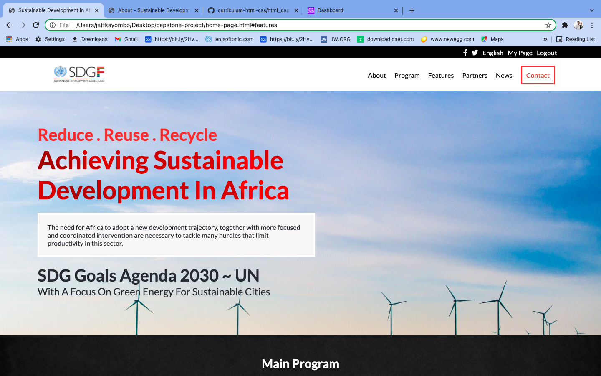

# Module 1: Capstone Project

> Building a personalized Captone-project to review the things learned so as to show an understanding and mastery of fundamentals learned.




## Live link
[Click here to see project]()

Additional description about the project and its features.

## Built With

- HTML5
- CSS3
- JavaScript


## Getting Started

**To get a copy of this repo into your local machine run the following command:**
```
git clone https://github.com/JEFFKAY16/capstone-project
cd capstone-project
in visual studio code you can click the go live button to view it live in the browser.
```

## Author

👤  **Jeff Kayombo**

- GitHub: [@JEFFKAY16](https://github.com/JEFFKAY16)


## 🤝 Contributing

Contributions, issues, and feature requests are welcome!
please reach me on my [Twitter Account](https://twitter.com/jeff_kayombo)

## Show your support

Give a ⭐️ if you like this project!

## Acknowledgments
- Original design idea by
[Cindy Shin in Behance](https://www.behance.net/adagio07)

## 📝 License

This project is [MIT](./MIT.md) licensed.
